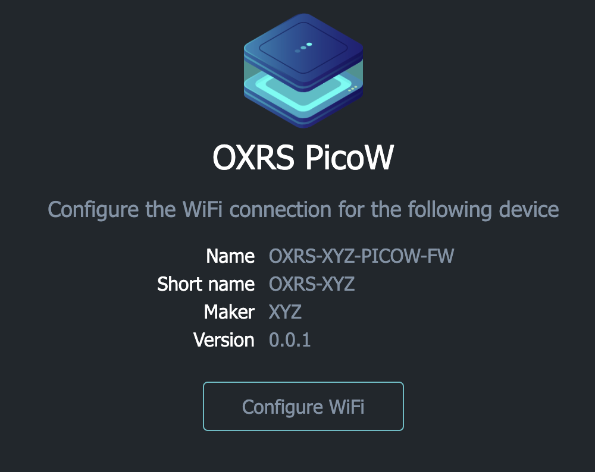
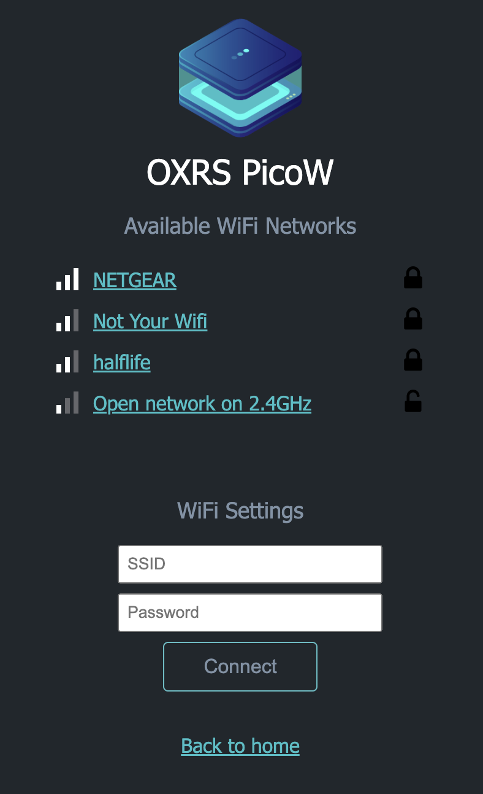

# WiFiManager for RaspberryPi PicoW

This library provides a captive portal similar to ESP23 WiFiManager implementations to allow WiFi credentials to be entered and stored in EEPROM so that devices can be configured to local WiFi networks.

Features
 - Customisable HTML content
 - Persistent storage of credentials in EEPROM 

It does not support OTA nor device configuration outside of WiFi credentials.

## Basic Usage

To create a captive portal:

    // Connect using saved creds, or start captive portal if none found. 
    // Blocks until connected or the portal is closed

    WiFiManager wm("ap_SSID", "ap_password");   // Access point credentials for portal
    bool success = wm.autoConnect();

By default, the portal appears as below. However, some basic customisation is available for the main (hero) image and title:

    const char hero_img[] PROGMEM = R"=====(
        data:image/png;base64, ..."
    )=====";

    String title("Cool device");
    wm.setContent(hero_img, title);
    bool success = wm.autoConnect();

where `hero_img` is a base64 encoded PNG in this case.

## Captive Portal

Following a similar approach to the ESP WiFiManager, if no WiFi credentials are found within EEPROM, the PicoW creates an access point with an SSID of and password of chosing. Once connected a captive portal is presented enabling selection of found WiFi networks and password to be entered. Once validated, these credentials are saved in EEPROM and used to connect on next restart.

The portal home page confirms the device attributes including name, maker and firmware version.

Whilst the captive portal has been tested on iOS, Android and macOS, windows has not. If the portal does not show, entering `http://picow.local` into the browser will pull it up.



The portal WiFi page allows configuration of the target network.



WiFi credentials can be erased using the AdminUI which will cause the captive portal to be presented on device restart.

## Content

The templates for the captive portal web assets (e.g. HTML, CSS, images) are defined in [WiFiManagerAssets.h](./src/WiFiManagerAssets.h) where web assets or fragments of HTML are stored as `PROGMEM` variables within flash. These variables are then consumed within [WiFiManager.cpp](./src/WiFiManager.cpp) to hydrate the web assets and perform any dynamic text or style substitutiions using `String` to replace `${variable_name}` with content.

The web assets are derived from web content held under [html](./html). These web assets can be extended and tested in isolation before being encoded into `PROGMEM` variables.

Note the use of EEPROM (used to store WiFi credentials) is [simulated](https://arduino-pico.readthedocs.io/en/latest/eeprom.html), since the Raspberry Pi Pico RP2040 does not come with an EEPROM onboard, it is simulated by using a single 4K chunk of flash at the end of flash space.

## Installation

For platformio, add the library as a reference to your main project under ```lib_deps```:

```
[env:pico]
platform = https://github.com/maxgerhardt/platform-raspberrypi.git
framework = arduino
board = rpipicow
board_build.core = earlephilhower
board_build.filesystem_size = 0.5m
monitor_filters = time
monitor_speed = 115200
lib_deps = 
	https://github.com/mthorley/wifimanager-pico.git
```

## Debugging

The library will output logs to Serial, if debug is enabled in the constructor:

```
bool debug = true;
WiFiManager wm("ap_SSID", "ap_password", debug);   // Access point 
```

## Attribution

Hero image is a nod to the excellent [OXRS ecosystem](https://oxrs.io/).